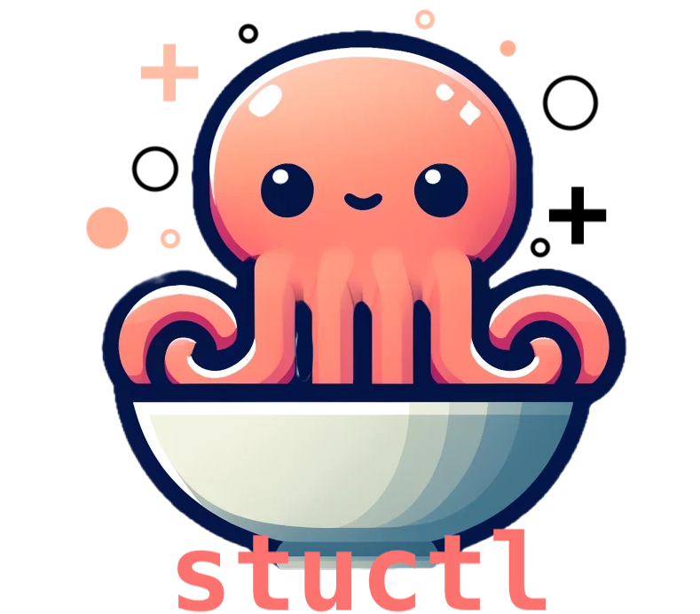
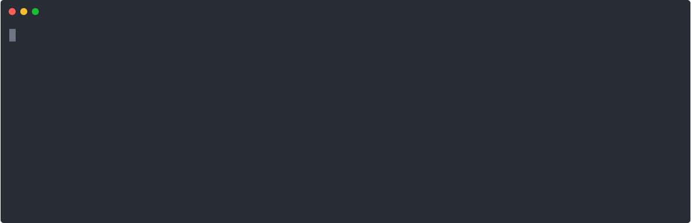

<p align="center">

<p align="center">
Studio control, better known as <i>stuctl</i> (affectionately pronounced <i>stew</i>-<i>cuttle</i>), is a simple command-line tool for interacting with Clear Street Studio via it's <a href="https://docs.clearstreet.io">public APIs</a>
</p>
<p align="center">
    
</p>
</p>

## Usage

The only prerequisite for using `stuctl` is having [nodejs](https://nodejs.org/) `v20.11.1` or higher installed.

Assuming you're running the right version node, run the following command to install `stuctl`:

```bash
$ npm install -g @clear-street/stuctl
```

Most commands provided by `stuctl` require authentication. To properly authenticate, you need to follow Clear Street Studio's [OAuth2 flow](https://docs.clearstreet.io/docs/authentication-1):

If you don't have an OAuth2 credentials already, here are the steps:

1. Sign into [Clear Street Studio](https://studio.clearstreet.io)
1. Navigate to `Settings -> Developer`
1. Create a new OAuth2 API credential
1. Download your credentials to a secure location

Now, you can provide `stuctl` the proper authentication using the `login` command:

```bash
$ stuctl login /path/to/oauth2-creds.json
```

You can now successfully invoke other `stuctl` commands, like `buy`, `sell`, etc.

## Data

This app persists data, such as access tokens, for use between runs. This data is stored in a file named `.sturc`. Values from the `.sturc` file are injected as environment variables when `stuctl` runs. The `.sturc` file lives in `~/.sturc` on Linux-based systems, or `%USERPROFILE%/.sturc` on Windows systems.

Since access tokens are stored in this file, _it's important you keep this file safe and secure._

You can set the default account with the command:
```bash
$ stuctle set account <your-account>
```
You can set the default URL with the command:
```bash
$ stuctle set url <studio-api-url>
```
Which will store the arguments for you in the `.sturc` file to avoid having to provide them through command-line arguments.

You can additionally manually add these values to your `.sturc`:

- `ACCOUNT=<your-account>`

This will default all commands that require an account to use `<your-account>`.

- `URL=<studio-api-url>`

This will point `stuctl` to the provided Studio API URL.
